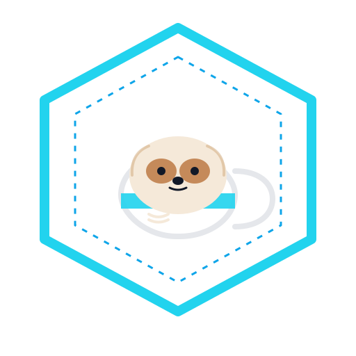

# 🦥 AutoVisuals  
### Automated Illustration & Prompt Generation Engine  
**A Sloths Visuals Project (by Sloths Intel)**

<div align="center">

</div>

---

[]()
[]()
[]()
[]()

---

# 📘 Overview

**AutoVisuals** is a modular AI engine designed to automatically generate:

- 🎨 High-quality creative themes 
- 🏷 Adobe Stock style metadata
- 📝 Midjourney-ready prompts   
- 🔄 Batch generation workflows  

Supports by default:

- OpenAI (GPT‑5.1)  
- Anthropic (Claude 3.x)  
- Google Gemini (1.5 Flash)

---

# 📁 Project Structure

<div style="overflow-x: auto;">

<pre>
AutoVisuals/
├─ autovisuals/
│  ├─ __init__.py
│  ├─ get_mj_prompt.py
│  ├─ pipelines/
│  │   └─ (future batch modules)
│  └─ data/
│      └─ adobe_cat.csv
│
├─ scripts/
│  ├─ run_get_mj_prompt.py
│  └─ run_batch_generation.py
│
├─ docs/
│  ├─ logo_light.svg
│  ├─ logo_dark.svg
│  └─ index.html
│
├─ requirements.txt
└─ README.md
</pre>

</div>


---

# 🚀 Quick Start

## 1. Install dependencies
```
conda create -n visuals python>=3.14
```
```
pip install openai anthropic google-generativeai
```
or
```
pip install -r requirements.txt
```
## 2. Export API key
```
export API_KEY="your-api-key"
```

## 3. Usage
### Basic command
```
python -m autovisuals.get_mj_prompt [options]
```

### Providers
```
-p openai
-p anthropic
-p gemini
```

### Theme mode
```
-m r          # random theme (weighted)
-m m          # manual theme (you will be prompted)
```

### Title mode
```
-t r          # random title
-t m          # manual title (only valid when -m m)
```

### Records count
```
-d 5          # generate 5 records
```

### Repeats value
```
-r 5          # style repeat value
```

### Theme list CSV
```
-l adobe_cat.csv
-l custom_list.csv
```
### Output folder
```
-o prompt
-o results
```

## 4. Quick examples
### 1. 5 random records using OpenAI
```
python -m autovisuals.get_mj_prompt -p openai -m r -t r -d 5
```
### 2. Manual theme + manual title
```
python -m autovisuals.get_mj_prompt -m m -t m
```
### 3. Use a custom theme list
```
python -m autovisuals.get_mj_prompt -l my_themes.csv
```
### 4. Save to custom output directory
```
python -m autovisuals.get_mj_prompt -o results
```

## 5. Help
```
python -m autovisuals.get_mj_prompt --help
```

---

# 🧠 Theme List Format
Each themes and its weights are in the same row, seperated by comma.
```
theme,weight
forest in fog,4
business teamwork,3
sunset over mountains,5
```

---

# 🖥 Example Output

## Midjourney Prompt
```
/imagine prompt futuristic cyber sloth sipping coffee in neon‑lit alley --ar 16:9 --s 20 --c 10 --raw --r 5
```

## Metadata JSON
```json
{
  "category": "nature",
  "theme": "forest in fog",
  "prompt": "futuristic forest scene...",
  "title": "Mysterious Forest Fog",
  "description": "A soft atmospheric forest scene.",
  "keywords": ["forest", "...", "generative ai"]
}
```
## Metadata CSV
<div style="overflow-x: auto; white-space: nowrap;">

| category  | theme                                 | prompt | title                                    | description | keywords |
|-----------|----------------------------------------|--------|-------------------------------------------|-------------|----------|
| business  | modern business collaboration          | a diverse team of young professionals collaborating in a modern open-plan office, people gathered around a sleek wooden table with laptops, tablets, and charts, large floor-to-ceiling windows revealing a city skyline, natural daylight streaming in, candid moment of teamwork and discussion, clean minimal interiors with plants and glass walls, shot at eye level, slight depth of field focusing on faces and gestures, contemporary corporate style, soft cinematic lighting, realistic colors, subtle reflections on glass and laptop screens, high-resolution photography, professional yet friendly mood, ultra-detailed, 8k, DSLR look, crisp focus, no text, no logos --ar 16:9 --s 20 --c 10 --raw --r 5 | Diverse Team Collaboration in Modern Office | A diverse group of professionals collaborates around a table in a bright modern office with city views. The image captures an authentic moment of teamwork and business planning. | business, teamwork, collaboration, modern office, startup, corporate, conference table, brainstorming, diverse team, young professionals, business meeting, city skyline, open plan office, coworking space, laptops, digital devices, office technology, business planning, project discussion, professional lifestyle, creative agency, corporate culture, leadership, office interior, glass walls, natural light, productivity, strategy session, business people, team communication, workplace, entrepreneurship, modern workspace, company office, business strategy, project management, business teamwork, office collaboration, business environment, business success, brainstorm session, professional meeting, creative teamwork, office workers, generative ai |
| nature    | dramatic mountain landscape at sunrise | /imagine prompt dramatic panoramic mountain landscape at sunrise, towering snow-capped peaks above a misty valley, golden light spilling over ridgelines, winding river reflecting the colorful sky, scattered pine trees in the foreground for depth, ultra wide-angle view, high-resolution detail in rocks and foliage, subtle clouds catching pink and orange hues, tranquil and majestic mood, natural color grading, no people, no buildings, cinematic landscape photography style, Nikon D850, 16mm lens, f/8, long exposure, crisp sharp focus, realistic textures, soft atmospheric haze in the distance --ar 16:9 --s 20 --c 10 --raw --r 5 | Dramatic Mountain Sunrise Landscape         | A dramatic sunrise illuminates snow-capped mountains and a misty valley, with a winding river reflecting the colorful sky. The wide-angle view captures the peaceful and majestic beauty of the natural landscape. | mountain landscape, sunrise mountains, snow-capped peaks, misty valley, winding river, golden hour light, dramatic sky, colorful sunrise, pine forest, natural scenery, panoramic view, wide-angle landscape, peaceful nature, majestic mountains, outdoor wilderness, scenic vista, rocky terrain, high altitude, morning mist, sunrise glow, nature background, tranquil scene, serene landscape, mountain valley, natural beauty, travel destination, scenic horizon, dramatic light, cloudy sunrise, unspoiled nature, national park scenery, remote wilderness, epic landscape, landscape photography, environmental beauty, sunlit peaks, atmospheric haze, outdoor adventure, nature wallpaper, idyllic scenery, mountain river, peaceful morning, dramatic panorama, dramatic panorama, generative ai |
| technology | modern technology innovation          | /imagine prompt ultramodern technology workspace with a diverse team of professionals collaborating around a luminous holographic user interface, transparent screens floating in mid-air displaying data visualizations, code, and global network maps, sleek minimalist office with glass walls overlooking a futuristic city skyline at dusk, cinematic wide-angle composition, soft blue and teal accent lighting, subtle reflections on polished surfaces, highly detailed, crisp focus, realistic textures with a hint of sci-fi, professional corporate mood, shot on a full-frame DSLR with 35mm lens, shallow depth of field, volumetric light rays, clean and uncluttered background, no text, no logos --ar 16:9 --s 20 --c 10 --raw --r 5 | Futuristic Technology Team in a Smart Office | A diverse team collaborates around holographic interfaces in a sleek, high-tech office overlooking a futuristic city. The scene highlights innovation, digital transformation, and modern technology in the workplace. | technology, futuristic office, digital innovation, holographic interface, data visualization, smart workplace, modern workspace, tech startup, digital transformation, network connectivity, cloud computing, cyber security, artificial intelligence, machine learning, big data, software development, programming, coding, IT professionals, diverse team, collaboration, business technology, virtual reality, augmented reality, user interface, UX design, data analytics, innovation concept, future of work, smart city, digital screens, blue lighting, corporate tech, high tech office, technology strategy, information technology, global network, startup culture, professional teamwork, modern business, digital economy, innovation hub, wireless connectivity, wireless connectivity, generative ai |

</div>

```
---

# 🧩 Use Inside Python

```python
from autovisuals.get_mj_prompt import generate_for_theme
item = generate_for_theme("openai", "misty mountains sunrise", repeat=5)
print(item["prompt"])
```

---

# 🧰 WSL/Linux/MacOS setup

```
cd ~/projects/AutoVisuals
pip install -r requirements.txt
echo 'export API_KEY="your_api_key"' >> ~/.bashrc
source ~/.bashrc
```

---

# 🏗 Future Modules
 
- Midjourney/Discord API integration  
- Illustration Scaling  
- GUI (AutoVisuals Studio)  

---

# 🤝 Contributing

Maintained by **Sloths Visuals** by [**Sloths Intel**](https://github.com/slothsintel), and [**@drxilu**](https://github.com/drxilu).

---

# 📄 License

MIT License.

---

# 🦥 About Sloths Visuals

A creative visualisation brand under **Sloths Intel**, specialising in data visulisation and automated illustration pipelines.
